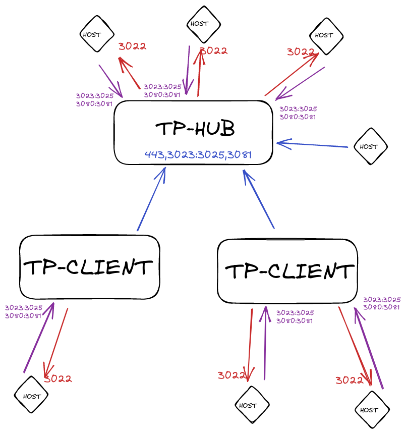

# **IMPORTANTE**

## **Todo es una documentacion basica para el uso personal y traspaso de conocimiento, no tener en cuenta para produccion si eres un Tercero.**

------
------
------

## **TAREAS/NOTAS**

* Limitar grabaciones aun no es posible, incluso se puede usar S3 <https://github.com/gravitational/teleport/discussions/7475>
* Para hacer conexiones RDP se necesita AD/GPO/CERT, todo seguro.

## **Instalacion y inicializacion**

### GoTeleport esta disponible para Ubuntu16+ y Debian9+

* <https://github.com/gravitational/teleport/blob/master/build.assets/tooling/cmd/build-os-package-repos/runners.go#L42-L67>

### **Iniciar Servidor Teleport**

* Ejecutar el siguiente script para iniciar el docker

```bash
prepare_docker.sh
```

* En caso de armar un Teleport-HUB se requiere usar SSL:

1. Configurar en nginx para que el puerto 443 redireccione contra el 3080 del docker y usar certificado SSL ya que es OBLIGATORIO para el uso de proxy, ademas tener la opcion "Websockets Support" habilitada.
2. Todos los demas puertos expuestos en docker tienen que ser accesible por NAT directamente contra el docker

* Generar usuario

```bash
docker exec teleport tctl users add usuario --roles=access,auditor,editor --logins=root
```

### **Agregar nodos**

#### **Nodos contra un TELEPORT-HUB**

*. Ejecutar el script de instalacion brindado por tu Teleport-HUB y asociarlo
*. Al tener la conexion establecidas, hacemos uan ediciones extras para nuestro nodo:

```bash
curl -s https://raw.githubusercontent.com/avillalba96/docker-teleport/main/install_central.sh | bash
```

#### **Nodos contra un TELEPORT-CLIENT**

*. Generar el token sobre el docker:

```bash
docker exec teleport tctl nodes add --ttl=1h
```

*. Ejecutar el script y completar con la informacion que se solicita:

```bash
curl -s https://raw.githubusercontent.com/avillalba96/docker-teleport/main/install_client.sh | bash -s 12.1.1
```

### **Agregar al Cluster**

* La conexion es Cliente --> Servidor.



* Desde el Teleport-HUB en docker generar el token que se usara:

```bash
docker exec teleport tctl tokens add --type=trusted_cluster --ttl=15m
```

* Desde un Teleport-CLIENT, en el apartado "Trusted" apuntar la informacion contra el Teleport Principal:

```bash
kind: trusted_cluster
metadata:
  name: tp.example-hub.com
spec:
  enabled: true
  role_map:
  - local:
    - access
    - auditor
    - editor
    remote: access
  token: TOKEN_ID
  tunnel_addr: tp.example-hub.com:3024
  web_proxy_addr: tp.example-hub.com:443
version: v2
```

* Ademas hay que editar el rol "auditor" agregando lo siguiente como parametro extra:
* <https://goteleport.com/docs/setup/reference/config/>

```bash
spec:
  allow:
    join_sessions:
    - kinds:
      - k8s
      - ssh
      modes:
      - moderator
      - observer
      - peer
      name: Auditor oversight
      roles:
      - auditor
```

### **Borrando Nodos/Clusters**

<https://goteleport.com/docs/management/admin/trustedclusters/>

```bash
docker exec teleport tctl get nodes
docker exec teleport tctl rm nodes/xxxxxxx-xxxxxxxx-xxxxxxxxx

docker exec teleport tctl get rc
docker exec teleport tctl rm rc/tp.example2.com
```

## **Actualizar cliente en nodo**

* Se deja un ejemplo para actualizar el cliente v10 a v12 en "upgrade_client_example.sh"
* **NOTA:** Porfavor leer la documentacion antes de aplicarlo, ya que al reiniciar el servicio teleport, si una variable cambio este no levantara.

## **Guia de comandos basicos**

```bash
### Insalamos TSH-CLIENT ###
curl https://goteleport.com/static/install.sh | bash -s 12.1.1

### Logeamos con usuario ###
tsh login --proxy=tp.example.com --user=username

### Logeamos a un cluster en concreto para ver los nodos o se verlos de todas formas ###
tsh login tp.example1.com
tsh ls
tsh clusters
tsh ls node --cluster=tp.example2.com

### Conectar a un nodo dentro del cluster, o conectar a un nodo en otro cluster ###
tsh ssh root@lnx-docker02
tsh ssh --cluster=tp.example2.com root@docker00

### Enviar comandos de forma remota ###
tsh ssh --cluster=tp.example2.com root@docker00 "free -h"
tsh scp example.txt user@host:/destination/dir

### Generando un tunnel forward para entrar localmente desde la notebook ###
# Comando para crear el tunnel
tsh ssh --cluster=tp.example2.com -L 8889:localhost:8443 root@docker00
# Generado redireccionamiento de puertos para hacer uso incluyendo el comando de arriba (se dejan distintas formas de crear el redir)
redir --lport 9999 --cport 8291 --caddr 10.65.0.73 &
socat TCP-LISTEN:9999,fork TCP:10.65.0.73:8291
nc -l 9999 | nc 10.65.0.73 8291

### Se pueden crear alias personalizados ###
1. Creando el archivo "sudo vi /etc/tsh.yaml"
2. Agregando dentro:

aliases:
    "connect": "bash -c 'tsh ssh --cluster=$0 $1@$2'"

3. Uso del comando:
tsh connect <CLUSTER> <USER> <HOST>
tsh connect tp.example2.com root docker00
```
