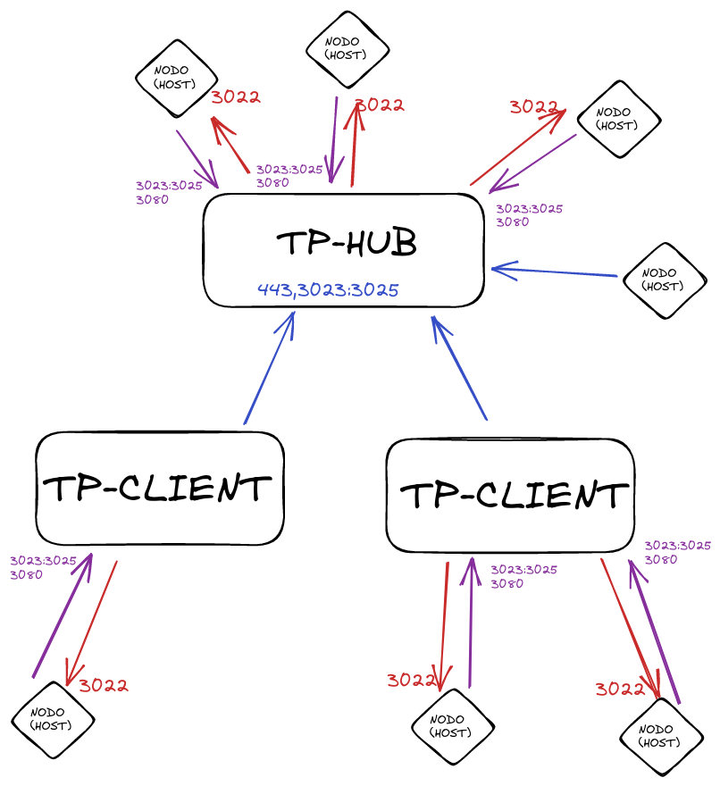

# **IMPORTANTE**

## **Todo es una documentacion basica para el uso personal y traspaso de conocimiento, no tener en cuenta para produccion si eres un Tercero.**

------
------
------

## **TAREAS/NOTAS**

* Acomodar tutorial para los windows

## **Instalacion y inicializacion**

### GoTeleport esta disponible para Ubuntu16+ y Debian9+

* <https://github.com/gravitational/teleport/blob/master/build.assets/tooling/cmd/build-os-package-repos/runners.go#L42-L67>

### **Iniciar Servidor Teleport**

#### **Generando el docker**

* Configurar para que los puertos 443/80(TCP) nateen contra el servidor *nginxproxymanager*
* Los demas puertos 3023:3026/TCP deben natear contra el servidior de teleport *(nosotros tambien configuramos que unicamente se pueda acceder desde ARG)*.
* El docker que tenga el servicio del Teleport necesita tener salida a internet, ya que las cookies/etc las consulta contra internet
* En caso de no usar el servicio proxy-teleport, es necesario que los nodos tengan el acceso teleport:3025(TCP) y que el teleport pueda acceder a ellos node:3022(TCP)

* Generamos y damos de alta el docker teleport

```bash
./prepare_docker.sh
```

* Ademas dentro del *nginxproxymanager* configurar las siguientes opciones OBLIGATORIAS *(en caso de usar ssl custom, requiere tener el certificado chain)*:


* En caso de querer filtrar unicamente desde ARG el acceso al sitio se puede bloquear desde el mismo *nginxproxymanager*

```bash
mkdir ./data/nginx/custom
cp ./examples/configs/cidr-arg.conf ./data/nginx/custom/.
cp ./examples/configs/RFC1918.conf ./data/nginx/custom/.
chown -R --reference=./data/access ./data/nginx/custom
```

* Se deja lo que hay que agregar en *Advanced* para utilizar los archivos indicados

```bash
location / {
    # Access Rules
    include /data/nginx/custom/cidr-arg.conf;
    include /data/nginx/custom/RFC1918.conf;
    deny all;

    # Access checks must...
    satisfy all;
    
    proxy_set_header Upgrade $http_upgrade;
    proxy_set_header Connection $http_connection;
    proxy_http_version 1.1;

    # Proxy!
    include conf.d/include/proxy.conf;
  }
```

* Generar usuarios genericos en teleport

```bash
#usuario ssh
docker exec teleport tctl users add usuario --roles=access,auditor,editor --logins=root
#usuario windows
docker exec teleport tctl users add usuario --roles=access,auditor,editor --windows-logins=Administrator
```

### **Agregar nodos/hosts**

#### **Nodos contra un TELEPORT-HUB *(Se usa para conectar contra un teleport a través de internet)***

* Ejecutar el script de instalacion brindado por tu Teleport-HUB y asociarlo
* Al tener la conexion establecida, hacemos unas ediciones extras para nuestro nodo:

```bash
############################################################################
## Este script es unicamente para agregar nodo SSH
sudo bash -c "$(curl -fsSL https://raw.githubusercontent.com/avillalba96/docker-teleport/main/scripts/installs/install_central.sh)"
############################################################################
## Este script es unicamente para agregar nodo KUBERNET
curl -O -fsSL https://raw.githubusercontent.com/avillalba96/docker-teleport/main/scripts/installs/install_central_k8s.sh && chmod +x install_central_k8s.sh && ./install_central_k8s.sh
############################################################################
```


#### **Nodos contra un TELEPORT-CLIENT *(Se usa para conectar contra un teleport local)***

* Generar el token sobre el docker:

```bash
docker exec teleport tctl nodes add --ttl=1h
```

* Ejecutar el script y completar con la informacion que se solicita:

```bash
# Instalancio Servicio
apt-get update; apt-get install apt-transport-https curl -y
if [ $(grep -c "VERSION_CODENAME" /etc/os-release) -eq 0 ]; then echo "FAIL: VERSION_CODENAME"; else curl https://goteleport.com/static/install.sh | bash -s 12.1.5; fi
# Recargando servicio en caso de actualizacion
#systemctl daemon-reload && systemctl reload teleport.service
# Agregando opciones personalizadas en "/etc/teleport.yaml"
curl -O https://raw.githubusercontent.com/avillalba96/docker-teleport/main/scripts/installs/install_client.sh && chmod +x install_client.sh && ./install_client.sh
```

### **Instalar descubrimiento de windows**

* <https://goteleport.com/docs/desktop-access/active-directory-manual/>
* <https://youtu.be/YvMqgcq0MTQ>

* Se requiere que el Servidor Teleport tenga acceso ldaps tcp/636 contra el equipo con ldap, ademas necesita acceso puerto rdp tcp/3389 contra todos los windows que descubra
* **Se siguieron los pasos tal cual en el docs/youtube, pero se dejan ejemplos/machete de lo que nosotros usamos**

```bash
#3/7
docker exec teleport tctl auth export --type=windows > user-ca.cer
#6/7
docker exec teleport tctl tokens add --type=windowsdesktop,node
```

* Se deja ejemplo de archivo "/etc/hosts"

```bash
# NPM - TELEPORT
X.X.X.X tp.example.com
X.X.X.X example.intranet ad.example.intranet
```

* Se deja ejemplo del archivo "/etc/teleport.yaml" en "examples/configs/teleport_server_example.yaml"

### **Agregar al Cluster**



* Se requiere que Teleport-CLIENT tenga salida a internet contra los puertos del Teleport-HUB:3023-3026(TCP)
* Hay que generar dos nuevos roles del lado de teleport Teleport-HUB y Teleport-CLIENT, ademas asignarlos a los usuarios correspondientes

```bash
cp examples/roles/rol_* teleport/config/
docker exec teleport tctl create -f /etc/teleport/rol_ssh-access.yaml
docker exec teleport tctl create -f /etc/teleport/rol_windows-desktop-admins.yaml
docker exec teleport tctl create -f /etc/teleport/rol_auditor.yaml
rm teleport/config/rol_*
#docker exec teleport tctl users update usuario --set-roles=ssh-access,windows-desktop-admins,auditor,access,editor
```

* Desde el Teleport-HUB en docker generar el token que se usara en el siguiente paso:

```bash
docker exec teleport tctl tokens add --type=trusted_cluster --ttl=15m
```

* Editar las variables *"tp.example-hub.com"* y *"TOKEN_ID"* en el archivo "examples/roles/trusted_cluster.yaml"
* Desde un Teleport-CLIENT generar el rol trusted

```bash
cp examples/roles/trusted_* teleport/config/
vi teleport/config/trusted_cluster.yaml
docker exec teleport tctl create -f /etc/teleport/trusted_cluster.yaml
rm teleport/config/trusted_*
```

### **Machete generico para GITHUB**

* Se dejan archivos de ejemplo en *examples/configs/teleport_auth...*
<https://goteleport.com/docs/access-controls/sso/github-sso/>

### **Instalando tsh personalizado**

* Se deja un script personalizado para uso de *"tsh"* por consola *(esta adaptado para uso personal)*
* Tambien se encuentra disponible un *autocompletion* para tsh_console, este deben configurar a su gusto en su bash_completion.d

```bash
mv ~/.kube/config ~/.kube/config_bkp; rm ~/.kube/config; ln -s ~/teleport-kubeconfig.yaml ~/.kube/config
export KUBECONFIG=${HOME?}/teleport-kubeconfig.yaml
sudo curl -o /usr/local/bin/tsh_console -L https://raw.githubusercontent.com/avillalba96/docker-teleport/main/scripts/others/tsh_console.sh && sudo chmod +x /usr/local/bin/tsh_console
```
